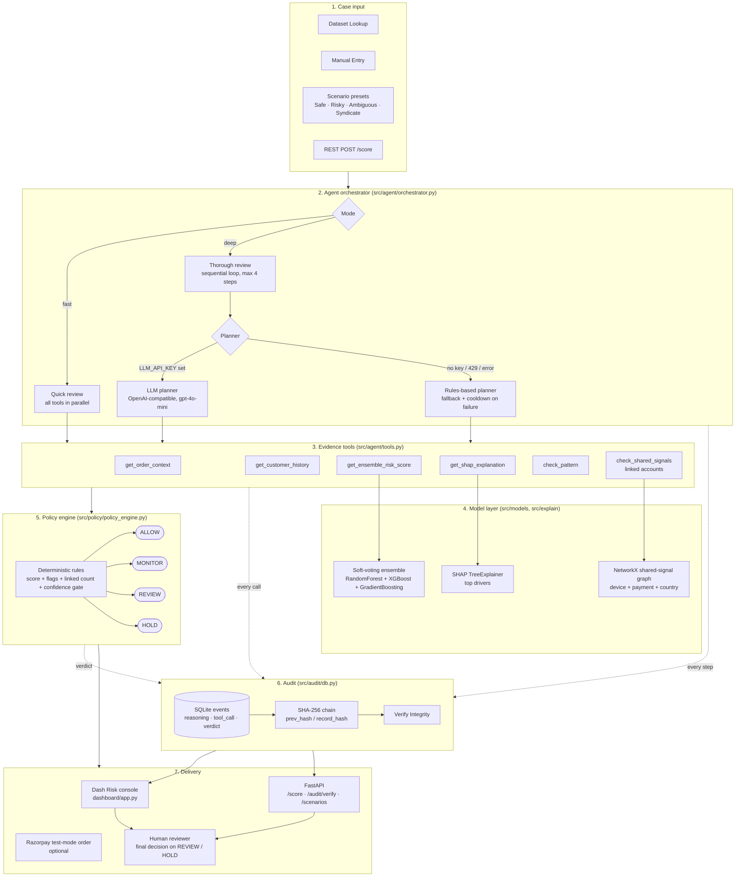

# Return Risk Agent

Razorpay AI Buildathon · Track 02: AI Risk Manager

**Live demo:** [https://return-risk-agent.onrender.com](https://return-risk-agent.onrender.com)

> Free Render instances sleep when idle. First open after sleep can take about one minute, then the Risk console loads.

**Defense-only:** recommends `ALLOW` / `MONITOR` / `REVIEW` / `HOLD`. Never auto-blocks, charges, bans, or takes an irreversible action against a customer. Dashboard metrics are **DEMO DATA** (synthetic).

---

## Problem

Return abuse (wardrobing, serial returners, linked accounts) costs merchants money. A single opaque risk score is hard to trust. Analysts need clear reasons and an audit trail before they hold or approve a refund.

## What this project does

1. Takes a return / refund case (from the demo dataset or manual entry).
2. Investigates with multiple checks: order context, customer history, ML risk score, top drivers, behaviour patterns, linked accounts.
3. Recommends one action: **ALLOW**, **MONITOR**, **REVIEW**, or **HOLD**.
4. Writes every step to a tamper-evident audit log so a reviewer can verify integrity.

A human still makes the final call. The system only advises.

## How to try the live demo

1. Open [https://return-risk-agent.onrender.com](https://return-risk-agent.onrender.com) (wait if the service is waking up).
2. Use Quick presets: **Safe**, **Risky**, **Ambiguous**, **Syndicate**.
3. Or use **Dataset Lookup** / **Manual Entry**, then score a case.
4. Open **Audit trail** and click **Verify Integrity**.

## Screenshots

Live GUI captures in [`docs/screenshots/`](docs/screenshots/).

---

## Stack

| Layer | Choice |
|-------|--------|
| Desk UI | Dash + Plotly + dash-bootstrap-components |
| API | FastAPI (`src/api/main.py`) |
| Agent | Multi-tool orchestrator (Quick parallel / Thorough sequential) |
| Scoring | Soft-voting ensemble (RandomForest + XGBoost + GradientBoosting) |
| Explainability | SHAP (TreeExplainer on RF member) |
| Policy | Deterministic rules in `src/policy/policy_engine.py` (no LLM) |
| Audit | SQLite + SHA-256 `prev_hash` / `record_hash` chain |
| Optional LLM | OpenAI-compatible chat API via env vars (planner only; default `gpt-4o-mini`) |
| Optional payments touchpoint | Razorpay test-mode order create |
| Hosting | Render Web Service + gunicorn (`dashboard.app:server`) |

## Architecture

End-to-end agentic flow: input, agent loop, evidence tools, model, policy, audit, and delivery surfaces.



**Who decides what**

| Layer | Owns | Never does |
|-------|------|------------|
| Agent orchestrator | Which tool to call next, in what order | Set the final action |
| LLM planner (optional) | Suggest next tool in Thorough mode | Emit ALLOW / HOLD |
| Evidence tools | Gather facts, score, explain, link accounts | Decide |
| Policy engine | Map evidence to one action | Call an LLM |
| Audit chain | Record and verify every step | Change past records silently |
| Human reviewer | Irreversible refund / account decision | Get auto-punished by the system |

More detail: [`docs/ARCHITECTURE.md`](docs/ARCHITECTURE.md) · static diagram: [`docs/architecture.png`](docs/architecture.png)

## Design choices

| Topic | Choice | Why |
|-------|--------|-----|
| Final action | Policy engine only | LLM may plan tools; never emits ALLOW/HOLD |
| Train/test split | Chronological | Avoid future leakage on time-ordered returns |
| Quick vs Thorough | Parallel vs sequential (max 4 steps) | Desk speed vs analyst depth |
| Linked accounts | Full fingerprint + behaviour | Avoid false rings from coarse attributes |
| Metrics | Disclosed DEMO DATA | Near-perfect scores are a red flag on synthetic data, not a production claim |

## Data honesty and production awareness

This buildathon demo uses **public synthetic** return-abuse datasets. That is intentional for a time-boxed submission: labeled merchant traffic is hard to obtain under NDA.

**What that means:**

- Ideal held-out precision/recall (near 1.0) is a **red flag**, not a win. The set is highly separable on behavioral aggregates (e.g. return rate). We disclose this with DEMO DATA badges, the model card, and a feature-ablation stress test.
- Real industry data is messy, incomplete, delayed, and drifts. Scores would be lower and less stable. A production path needs merchant labels, monitoring, recalibration, and human review SLAs.
- Leakage-prone proxy flags are excluded from the ML feature matrix; chronological split is used instead of random split.

See [`docs/MODEL_CARD.md`](docs/MODEL_CARD.md). Artifacts (`.joblib`, processed tables, audit DB) are not committed; train at build/run time.

## Project layout

```
src/           agent, policy, models, audit, api, features
dashboard/     Dash Risk console
tests/         pytest suite
data/raw/      synthetic training CSVs
docs/          architecture, model card, screenshots
scripts/       train smoke, ablation, architecture diagram
```

## Quick start (local)

```bash
python -m venv .venv
# Windows: .\.venv\Scripts\activate
# macOS/Linux: source .venv/bin/activate
pip install -r requirements.txt
set PYTHONPATH=.
python -m src.models.train_ensemble --sample-n 20000
python dashboard/app.py
```

- Local dashboard: http://127.0.0.1:8050
- Optional API: `uvicorn src.api.main:app --reload --port 8000` then http://127.0.0.1:8000/docs
- Live demo: [https://return-risk-agent.onrender.com](https://return-risk-agent.onrender.com)

Copy `.env.example` to `.env` for optional:

- `LLM_API_KEY`, `LLM_BASE_URL`, `LLM_MODEL`
- `RAZORPAY_KEY_ID`, `RAZORPAY_KEY_SECRET`

Without an LLM key, Thorough review uses the rules-based planner (same tools + same policy).

## Tests

```bash
set PYTHONPATH=.
pytest -q
```

## Deploy notes (Render)

- Start: `PYTHONPATH=. gunicorn dashboard.app:server --bind 0.0.0.0:$PORT`
- Build should train the model (artifacts are gitignored)
- See `render.yaml` and `runtime.txt` (Python 3.12)

---

## License

MIT. Demo and research prototype on synthetic datasets. Not a production fraud decisioning system.
