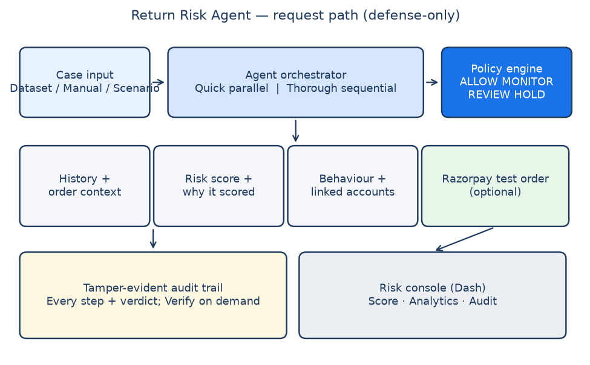

# Architecture

## Trust boundaries

| Layer | Responsibility | Autonomy |
|------|----------------|----------|
| Agent orchestrator | Plan next evidence step; call tools; write reasoning | Bounded (max 4 iterations) |
| ML ensemble + SHAP | Score + local explanation | Deterministic given features |
| Shared-signal graph | Optional syndicate linkage via NetworkX | Deterministic |
| Policy engine | Final action mapping | Deterministic, no LLM |
| Human reviewer | Irreversible refund / account decisions | Required for HOLD/REVIEW |

The LLM (when configured) **never** emits the final action. If the LLM API is down, a heuristic planner preserves the same tool-use loop.

## Request path

1. `POST /score` receives a case (`customer_id`, optional `order_id`, feature map).
2. Orchestrator iterates tools and logs each step to SQLite.
3. Policy engine returns `ALLOW` / `MONITOR` / `REVIEW` / `HOLD`.
4. Response includes risk score, rationale, evidence, agent trace, and `latency_ms`.

## Tools

- `get_customer_history`
- `get_ensemble_risk_score`
- `get_shap_explanation`
- `check_pattern`
- `get_order_context`
- `check_shared_signals` (Tier-2 abuse-ring)

## Cost & ROI model

Held-out evaluation produces:

- Precision / Recall / F1 / PR-AUC
- FP friction cost (₹)
- Fraud loss prevented (₹)
- **Net Protected Value = Fraud Loss Prevented − FP Friction Cost**
- x-times ROI

Assumptions are explicit in `src/cost/roi.py` and the model card.

## Deployment

- Local API: `uvicorn src.api.main:app --port 8000`
- Local desk: `python dashboard/app.py` → http://127.0.0.1:8050
- Packaged: `docker compose up --build`
- Optional later: public Streamlit/Render URL (not required for a complete demo)

The Dash desk is a **single page**: scenario simulator, live score, stakeholder drill-down (click a case bar), SHAP drivers, syndicate network graph, action mix, latency, hash-chained audit activity, and integrity verification.

## Investigation modes (latency vs thoroughness)

The orchestrator exposes two deliberate paths:

| Mode | Trigger | Behavior |
|------|---------|----------|
| **Fast path** | Dashboard default (`fast=True`) | Parallel tool gather (~100 ms). Best for production-scale throughput and live desk scoring. |
| **Deep investigation** | Dashboard toggle (`fast=False`) | Sequential agent loop (≤4 iterations). LLM plans each step when `LLM_API_KEY` is set; otherwise a heuristic planner preserves the same iterative structure. Best for ambiguous/high-stakes cases or analyst-triggered re-investigation. |

This is an intentional latency/thoroughness trade-off - not a missing feature. The **policy engine always decides the final action** in both modes.

## Audit integrity

Audit events are hash-chained (`prev_hash` → `record_hash` SHA-256). Use `GET /audit/verify` or the dashboard **Verify Integrity** button to detect tampering.
